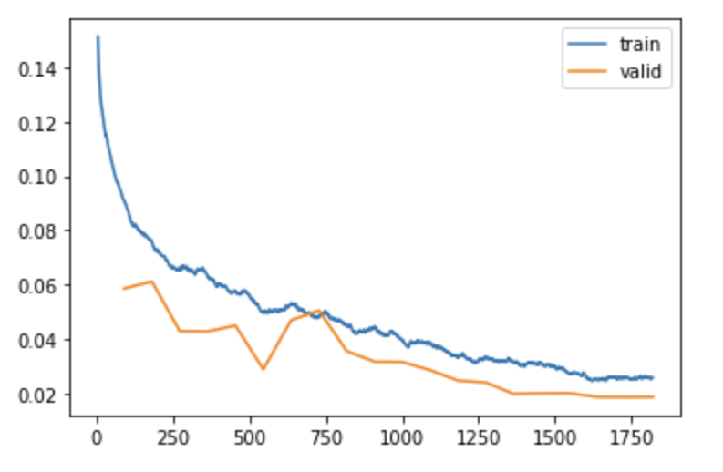

# Human Activity Recognition
 Human Activity Recognition (HAR) with Samsung Mobile Sensor Data and Fast v2

 
## Dataset

[1] Records 30 volunteer subjects, ages 19-48 years, performed six activities with mobile embedded accelerometer and gyroscope around the waist. captured 3-axial linear acceleration and 3-axial angular velocity at a constant rate of 50Hz. The obtained dataset has been randomly partitioned into two sets, where 70% of the volunteers was selected for generating the training data and 30% the test data.

Classes:

0: Walking

1: Walking Upstairs

2: Walking Downstairs

3: Sitting

4: Standing

5: Laying

Training Examples: 7352
Test Examples: 2947

[1] Davide Anguita, Alessandro Ghio, Luca Oneto, Xavier Parra and Jorge L. Reyes-Ortiz. 
A Public Domain Dataset for Human Activity Recognition Using Smartphones. 
21th European Symposium on Artificial Neural Networks, Computational Intelligence and Machine Learning, ESANN 2013. Bruges, Belgium 24-26 April 2013.

## Training

HAR Model Architecture developed with PyTorch, with 
a series on convolutional, dropout, and adaptive pooling layers and trained with the Fast.ai (v2) library:

## Inference

88% Accuracy
